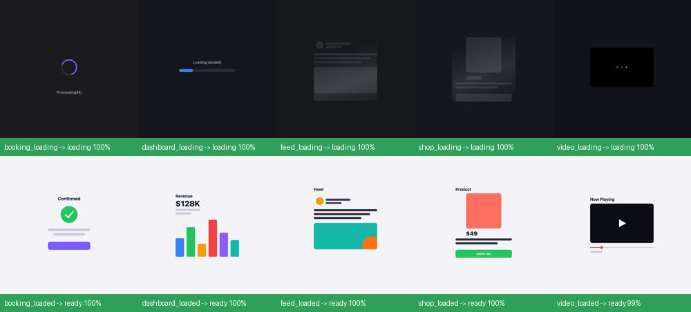

# watcher-model — a tiny local "is the page loaded?" vision model

A proof-of-concept of the idea from [`../Agent/REPORT.md`](../Agent/REPORT.md):
a **small model that watches the screen and tells you the moment a page is
ready**, so an expensive agent can wait for an interrupt instead of burning
whole turns polling with screenshots.

It's a from-scratch **NumPy CNN** (no PyTorch/TensorFlow/scikit-learn — just
numpy + Pillow) trained to classify a screenshot as **`loading`** vs **`ready`**,
across 5 different website types.

## Result

**10/10 on held-out real browser screenshots** (frames captured at a window
size the model never trained on). See `data/results.png`:



| | booking | feed | dashboard | video | shop |
|---|---|---|---|---|---|
| loading | ✅ | ✅ | ✅ | ✅ | ✅ |
| ready | ✅ | ✅ | ✅ | ✅ | ✅ |

The model is ~**0.5 MB** of weights, runs a classification in a few
milliseconds on CPU, and trains in well under a minute.

## The 5 site types

Each has a visually distinct loading indicator, so the model learns the general
concept rather than one page's pixels (`data/preview.png` shows all 10 states):

| site | loading cue | ready cue |
|---|---|---|
| booking | circular spinner | green check + button |
| feed | skeleton + shimmer | avatar + text + image |
| dashboard | progress bar | bar chart + KPI |
| video | buffering dots | play triangle + scrubber |
| shop | shimmer placeholder | product + price + cart |

The live, browsable versions are in [`sites/`](sites/) (open `sites/index.html`).

## How it was built (and the domain-gap story)

1. **Synthetic renderer** (`render.py`) draws unlimited randomized variants of
   each site with PIL — random colours, positions, **background lightness
   independent of phase** (so the model can't cheat on "dark = loading"), and
   **random content scale/placement** (so it isn't fooled by how much of the
   frame the app fills).
2. **Real screenshots** (`data/realtrain/`) captured from the actual running
   sites via the browser, then heavily augmented (`make_dataset.py`): random
   zoom **in and out** (padding with the page's own background), jitter,
   brightness/contrast, noise. This is what closed the synthetic→real gap.
3. **Tiny CNN** (`model.py`): `conv(3→8) → pool → conv(8→16) → pool → fc → 2`,
   Adam, softmax cross-entropy — all hand-written in NumPy.

Training on synthetic **only** already hit 9/10 on real frames; the last case
(`video` ready — a dark player pane looks almost identical whether it shows 3
buffering dots or a small play triangle) only fell once a few **real** video
frames at different window sizes were added. Lesson: for near-degenerate visual
states, a little real data beats a lot of synthetic.

## Files

| file | purpose |
|---|---|
| `render.py` | synthetic site renderer (data source) |
| `make_dataset.py` | build `data/dataset.npz` from synthetic + augmented real frames |
| `model.py` | the NumPy CNN (forward/backward/Adam/save/load) |
| `train.py` | train → `model.npz`, prints per-site accuracy |
| `predict.py` | classify image(s): `python3 predict.py "data/real/*.png"` |
| `watch.py` | the watcher loop — polls the screen, fires when READY |
| `sites/` | 5 real canvas websites + index |
| `data/realtrain/` | real screenshots used for training |
| `data/real/` | held-out real screenshots used for testing |

## Reproduce

```bash
cd watcher-model
python3 make_dataset.py       # build dataset (synthetic + augmented real)
python3 train.py              # train -> model.npz
python3 predict.py "data/real/*.png"   # evaluate on held-out real frames
```

## Run the watcher live

```bash
python3 watch.py --image data/real/video_loaded.png   # one-shot
python3 watch.py X Y W H       # poll a screen region (macOS screencapture); prints READY when the page settles
```

`watch.py` is the payoff: a cheap loop that watches pixels and emits a single
"READY" edge — the interrupt the computer-use toolset is missing.
